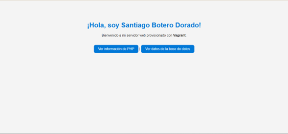
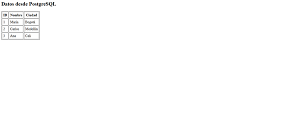

# 🧰 Taller de Provisionamiento con Vagrant  

**Autor:** Santiago Botero Dorado  
**Asignatura:** Sistemas Operativos  
**Fecha:** Octubre de 2025  

---

## 📘 Descripción del Proyecto
Este proyecto implementa un entorno de **provisionamiento automatizado con Vagrant**, compuesto por dos máquinas virtuales conectadas mediante una red privada interna:

- 🌐 **Web:** Servidor Apache + PHP.  
- 🗄️ **DB:** Servidor PostgreSQL con base de datos y tabla inicial.

El propósito del taller es demostrar cómo se pueden crear, configurar y conectar automáticamente múltiples máquinas virtuales mediante scripts de aprovisionamiento, logrando un entorno funcional de servidor web y base de datos completamente automatizado.

---
Evidencias
 Página principal (index.html)     
 Info PHP (info.php)                 
 Datos desde PostgreSQL (db.php)  

## ⚙️ Requisitos Previos

Antes de ejecutar el proyecto, asegúrate de tener instalados:

- [VirtualBox](https://www.virtualbox.org/wiki/Downloads)
- [Vagrant](https://developer.hashicorp.com/vagrant/downloads)
- [Git](https://git-scm.com/download/win)

---

## 📂 Estructura del Proyecto
